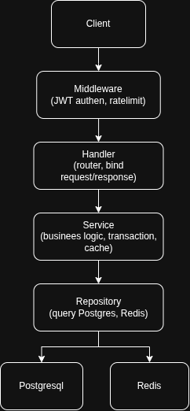
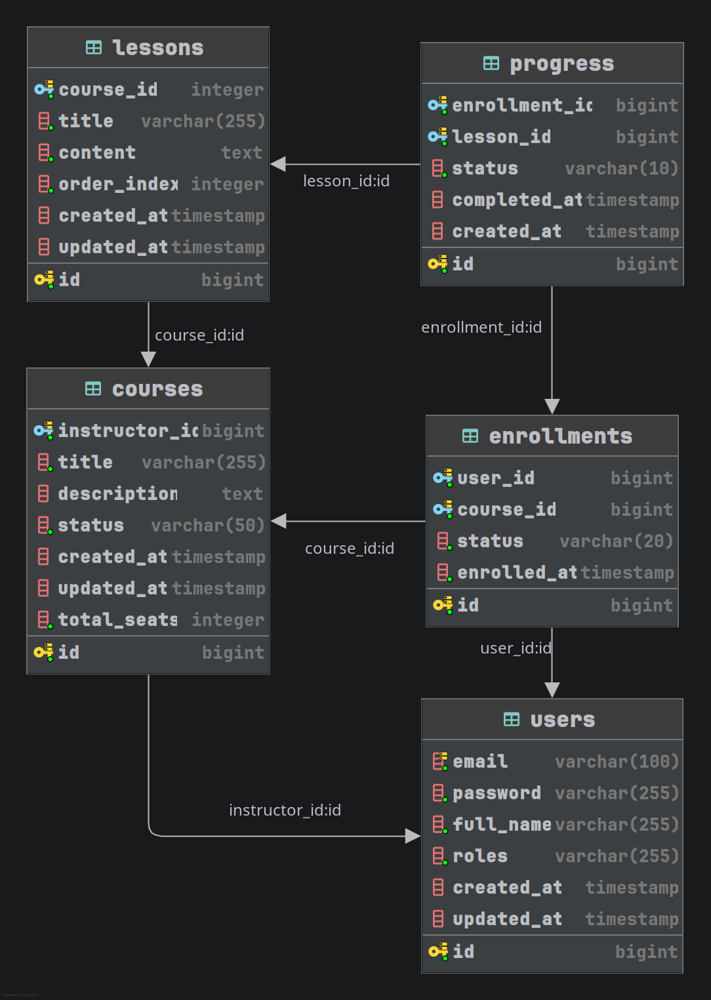

## Tính năng
- Đăng ký, đăng nhập, xác thực người dùng bằng JWT, phân quyền theo vai trò (user, instructor, admin)
- CRUD khoá học, giới hạn theo instructor sở hữu, hỗ trợ phân trang/tìm kiếm/lọc
- Rate limit cho login (Redis, fixed window)
- Bài học (lesson) nằm trong khoá học
- Đăng ký khoá học với cơ chế tăng/giảm số chỗ nguyên tử (transaction Postgres + unique constraint), có lớp cache-aside bằng Redis cho các truy vấn đọc khoá học
- Theo dõi tiến độ học theo từng bài học, gắn với từng lượt đăng ký

## Architecture Diagram


## DB Diagram


- 1 user (vai trò instructor) sở hữu nhiều course. ON DELETE CASCADE: xoá user thì xoá luôn course của họ.
- 1 course có nhiều lesson, thứ tự hiển thị qua order_index. Xoá course → xoá cascade lesson.
- enrollments là bảng nối giữa users và courses, mỗi record là một lượt đăng ký
- ràng buộc: 1 user chỉ đăng ký 1 course
- progress nối enrollments với lessons — theo dõi tiến độ học theo từng lượt đăng ký

## Cấu trúc dự án
```
cmd/api/             file main: load config, chạy migration, connect DB, start server
internal/
  configs/           cấu hình đọc từ env (Viper)
  di/                wire container: nối handler/service/repo với nhau
  handlers/          tầng HTTP (đăng ký route Gin + bind request/response)
  middleware/        middleware auth (JWT) và rate-limit
  models/            entity domain và kiểu AppError
  platform/          chứa các hàm helper để connect tới các service bên ngoài (DB, redis, JWT, RateLimit)
  repositories/      truy cập dữ liệu Postgres/Redis
  services/          business logic, transaction, caching
migrations/          file SQL migration của golang-migrate
pkg/logger/          helper logging dùng chung
docs/                thư mục chứa tài liệu
```

## Hướng dẫn cài đặt
### Yêu cầu: 
- cài đặt Docker, 
- Go 1.25
- golang-migrate 
    ```
  go install github.com/google/wire/cmd/wire@latest
  ```
- mockery
    ```
  go install github.com/vektra/mockery/v2@latest
  ```
### Các bước thực hiện
B1. Copy các key bên dưới vào file `.env` và điền các giá trị tương ứng
```
DATABASE_URL=
MIGRATION_PATH=migrations
APP_PORT=
JWT_SECRET=
JWT_TTL_MINUTES=

REDIS_HOST=
REDIS_PORT=
REDIS_PASSWORD=
REDIS_DB=
REDIS_TTL_MINUTES=
```

B2. Chạy docker compose để khởi chạy API, Postgres, Redis
```
docker compose up --build
```
| Service | Port |
|---|---|
`app` | 8080 |
`postgres` | 5433 |
`redis` | 6379 |
